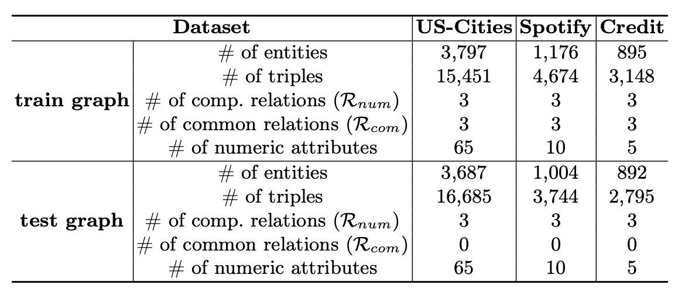

# RRNE - Relation-aware Relative Numeric Encoding

This code is based on [GraIL](https://github.com/kkteru/grail).

## Requiremetns

All the required packages can be installed by running `pip install -r requirements.txt`.

## Data statistics

Our data statistics are as follows:

# Train
For traning of RRNE on Credit or Spotify, please run below code

	python train.py -d $dataset -e $exp_name --input_feature rra --order_loss l2 --use_self self_1 --use_numric --self_margin 1.0 --hop $hop
 
 For traning of RRNE on US-cities please run below code

 	python train.py -d USA_sparse_f -e $exp_name --input_feature rra --order_loss l2 --use_self self_1 --use_numric --self_margin 1.0 --hop 3 --self_coef 0.25

  	python train.py -d USA_sparse_f -e $exp_name --input_feature rra --order_loss l2 --use_self self_1 --use_numric --self_margin 1.0 --hop 4 --batch_size 4 --lr 2e-3 --self_coef 0.25

# Test
For test of RRNE, please run below code

	python train.pyd -d $dataset_ind -e $exp_name --use_numeric --hop $hop
